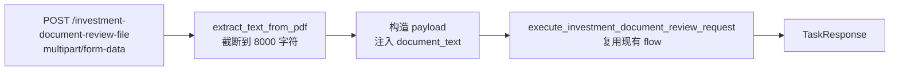
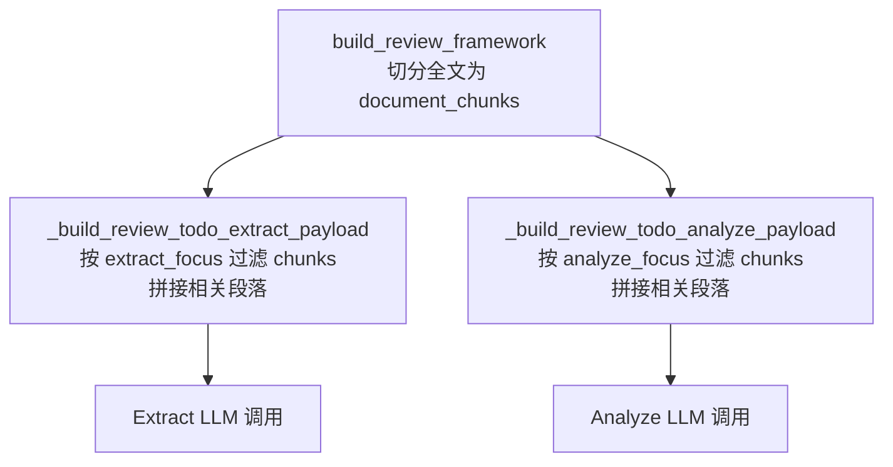

# PDF 长文档处理计划

## 现状摘要

- 当前 `/investment-document-review` 只接受 JSON，`document_text` 字符串由调用方提供
- `pdfplumber`、`python-multipart` 均未安装，`pyproject.toml` 无 PDF 依赖
- `detect_missing_fields` 只检查 `document_text` 是否有值，API 层注入后**零改动**可复用
- To-Do DAG 的 `_build_review_todo_extract_payload` / `_build_review_todo_analyze_payload` 两个方法直接从 `state.input_payload.get("document_text")` 取全文，无任何 chunking
- `build_review_framework` 节点已持有 `extract_focus` / `analyze_focus`，是预切分 chunks 的理想位置

---

## Phase A — Gateway 层 PDF 上传 endpoint

### 目标

新增 `POST /investment-document-review-file`，接收 `multipart/form-data`，服务端提取文字，构造与现有 JSON endpoint 等价的 payload，复用 `execute_investment_document_review_request`。

### 新增依赖

在 `pyproject.toml` 中添加：
- `pdfplumber` — PDF 文字提取，含表格处理，适合 factsheet 格式
- `python-multipart` — FastAPI 文件上传必须

### 新文件

`src/investory/gateway/pdf_extractor.py`

```python
def extract_text_from_pdf(file_bytes: bytes, max_chars: int = 8000) -> str:
    # pdfplumber 逐页提取，清理空行，截断到 max_chars
```

- 截断上限暂定 8000 字符（与 v1 文档约束一致）
- 提取失败时 raise `ValueError`，由 endpoint 转为 400 响应

### 修改文件

`src/investory/gateway/schemas.py`

- 新增 `InvestmentDocumentReviewFileUploadRequest`，不继承 `FlowRequest`，字段使用 `UploadFile` + `Form`

```python
class InvestmentDocumentReviewFileUploadRequest:
    def __init__(
        self,
        file: UploadFile,
        review_goal: str | None = Form(default=None),
        document_type_hint: str | None = Form(default=None),
        session_id: str | None = Form(default=None),
    ): ...
```

`src/investory/gateway/api.py`

- 新增 `INVESTMENT_DOCUMENT_REVIEW_FILE_ROUTE = "/investment-document-review-file"` 常量
- 新增 `run_investment_document_review_file` endpoint：提取文字 → 注入 `payload["document_text"]` → 调用 `execute_investment_document_review_request`

### 数据流



### 验收

- 上传 ETF factsheet PDF → 得到与 JSON endpoint Case 3 等价的 `action: complete` 响应
- 上传损坏 PDF → 返回 400，`error.error_type: pdf_extraction_failed`
- 无 PDF 上传 → 依赖 FastAPI validation 返回 422

---

## Phase B — Flow 内部 Chunking

### 目标

让 To-Do DAG 各子任务按 `extract_focus` / `analyze_focus` 关键词接收相关段落切片，而不是全文。单次 extract/analyze 任务的 `document_text` 从全文降至相关段落。

### 方案

**1. 纯文本段落切分（不引入向量库）**

按段落/句子切分全文为 `list[str]` chunks，再对每个 chunk 做关键词匹配（简单 `any(kw in chunk)` 过滤），选出与当前任务 focus 最相关的若干 chunks 拼接传入。不引入 embedding 或向量数据库，保持与现有无额外基础设施依赖的风格。

**2. 接入位置**

`src/investory/agent_core/contracts/investment_document_review_state.py` 新增字段：

```python
document_chunks: list[str] = Field(default_factory=list)
```

`build_review_framework` 节点末尾：在已有逻辑后，切分 `state.input_payload["document_text"]` 为 chunks，写入 `state.document_chunks`。

`_build_review_todo_extract_payload`：从 `state.document_chunks` 中按 `extract_focus` 过滤，拼接相关 chunks 代替全文。

`_build_review_todo_analyze_payload`：同样按 `analyze_focus` 过滤。

**3. 兼容性**

- `document_chunks` 为空时（chunks 构建失败或 single-pass 路径），fallback 到 `state.input_payload.get("document_text")`，现有行为不变
- single-pass review 路径（当前公开主路径）完全不受影响

### 数据流



### 新文件

`src/investory/agent_core/runtime/flow/investment_document_review/document_chunker.py`

```python
def split_into_chunks(text: str, chunk_size: int = 500) -> list[str]: ...
def select_relevant_chunks(
    chunks: list[str],
    focus_keywords: list[str],
    max_chars: int = 4000,
) -> str: ...
```

---

## 实施顺序

Phase A 和 Phase B 独立，可按任意顺序或并行推进。建议先做 Phase A，因为它让真实 PDF 测试成为可能，反过来验证 Phase B 的 chunking 效果。