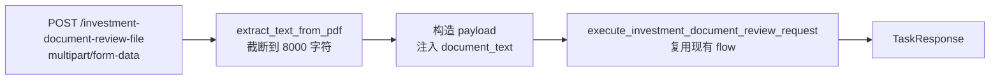
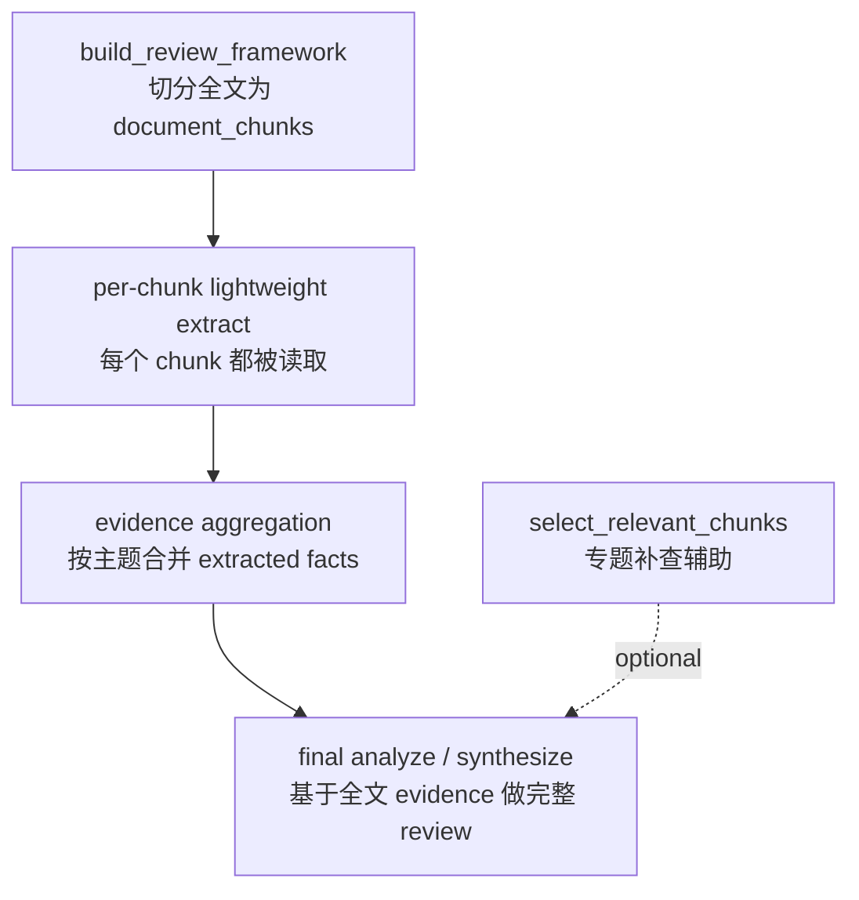

# PDF 长文档处理计划

## 现状摘要

- 当前 `/investment-document-review` 只接受 JSON，`document_text` 字符串由调用方提供
- `pdfplumber`、`python-multipart` 均未安装，`pyproject.toml` 无 PDF 依赖
- `detect_missing_fields` 只检查 `document_text` 是否有值，API 层注入后**零改动**可复用
- To-Do DAG 的 `_build_review_todo_extract_payload` / `_build_review_todo_analyze_payload` 两个方法直接从 `state.input_payload.get("document_text")` 取全文，无任何 chunking
- `build_review_framework` 节点已持有 `extract_focus` / `analyze_focus`，是预切分 chunks 的理想位置

---

## Phase A — Gateway 层 PDF 上传 endpoint

### 目标

新增 `POST /investment-document-review-file`，接收 `multipart/form-data`，服务端提取文字，构造与现有 JSON endpoint 等价的 payload，复用 `execute_investment_document_review_request`。

### 新增依赖

在 `pyproject.toml` 中添加：
- `pdfplumber` — PDF 文字提取，含表格处理，适合 factsheet 格式
- `python-multipart` — FastAPI 文件上传必须

### 新文件

`src/investory/gateway/pdf_extractor.py`

```python
def extract_text_from_pdf(file_bytes: bytes, max_chars: int = 8000) -> str:
    # pdfplumber 逐页提取，清理空行，截断到 max_chars
```

- 截断上限暂定 8000 字符（与 v1 文档约束一致）
- 提取失败时 raise `ValueError`，由 endpoint 转为 400 响应

### 修改文件

`src/investory/gateway/schemas.py`

- 新增 `InvestmentDocumentReviewFileUploadRequest`，不继承 `FlowRequest`，字段使用 `UploadFile` + `Form`

```python
class InvestmentDocumentReviewFileUploadRequest:
    def __init__(
        self,
        file: UploadFile,
        review_goal: str | None = Form(default=None),
        document_type_hint: str | None = Form(default=None),
        session_id: str | None = Form(default=None),
    ): ...
```

`src/investory/gateway/api.py`

- 新增 `INVESTMENT_DOCUMENT_REVIEW_FILE_ROUTE = "/investment-document-review-file"` 常量
- 新增 `run_investment_document_review_file` endpoint：提取文字 → 注入 `payload["document_text"]` → 调用 `execute_investment_document_review_request`

### 数据流



### 验收

- 上传 ETF factsheet PDF → 得到与 JSON endpoint Case 3 等价的 `action: complete` 响应
- 上传损坏 PDF → 返回 400，`error.error_type: pdf_extraction_failed`
- 无 PDF 上传 → 依赖 FastAPI validation 返回 422

---

## Phase B — Flow 内部 Chunking

### 目标

让长 PDF 在 Flow 内部被拆成多个 chunks，并确保**每个 chunk 都被读取和覆盖**。单个 chunk 只做轻量、结构化 evidence extract；完整 review 结论不在 chunk 层直接生成，而是在所有 chunks 的 evidence 聚合后统一 analyze / synthesize。

### 方案

**1. 全文覆盖的分层 map-reduce review**

主路径不再按 `extract_focus` / `analyze_focus` 过滤 chunks，也不把 `select_relevant_chunks()` 作为决定哪些内容进入 review 的机制。原因是 investment document review 的产品语义是“完整审查文档”，任何关键词筛选都会有漏审风险。

推荐主流程：

1. `split_into_chunks(document_text)` 将全文切成 `list[str]` chunks。
2. 对每个 chunk 都执行轻量 extract，提取事实、风险信号、费用、限制、异常、披露缺口等结构化 evidence。
3. 按主题聚合所有 chunks 的 extracted facts，例如 fees、risk、liquidity、performance、issuer、disclosure gaps。
4. 基于聚合后的全文 evidence 做最终 analyze / synthesize，输出完整 review 结论。

这种设计区分了两个层级：

- chunk 层：目标是覆盖全文和不漏信息，只做轻量 evidence extraction。
- final 层：目标是形成完整判断，只在 evidence 聚合后做全面分析。

**2. `select_relevant_chunks()` 的定位**

`select_relevant_chunks()` 不属于完整 review 主路径。它会主动丢弃未命中关键词的 chunks，因此不能用于决定哪些 chunks 被 review。

它只适合作为**专题补查 / targeted retrieval** 辅助能力，例如：

- 最终分析发现费用披露不清，需要回看 fee / expense ratio 相关片段。
- 用户单独追问某个主题，如 liquidity、redemption、risk disclosure。
- 在全文 map-reduce 已完成后，对某个专题做二次证据补强。

RAG 也遵循同样边界：适合作为专题补强能力，不适合作为完整审查的唯一主路径。长期更稳妥的方案是 hybrid：全文 chunks 先做 map-reduce 式全覆盖 extract，确保每个 chunk 都被审查；再用关键词检索或 embedding/RAG 对费用、风险、流动性、披露缺口等专题做补强。

**3. 接入位置**

`src/investory/agent_core/contracts/investment_document_review_state.py` 新增字段：

```python
document_chunks: list[str] = Field(default_factory=list)
```

`build_review_framework` 节点末尾：在已有逻辑后，切分 `state.input_payload["document_text"]` 为 chunks，写入 `state.document_chunks`。

后续 To-Do DAG 应增加或调整为两个阶段：

- per-chunk extract：遍历 `state.document_chunks`，对每个 chunk 构造轻量 extract payload。
- aggregate + synthesize：聚合所有 chunk evidence，再执行完整 analyze / synthesize。

**4. 兼容性**

- `document_chunks` 为空时（chunks 构建失败或文档极短），fallback 到现有 single-pass review 路径，保证旧行为可用。
- single-pass review 路径（当前公开主路径）在 Phase B 接入前仍可保持不变。
- `select_relevant_chunks()` 即使保留，也只作为可选专题补查工具，不影响全文覆盖主路径。

### 数据流



### 新文件

`src/investory/agent_core/runtime/flow/investment_document_review/document_chunker.py`

```python
def split_into_chunks(text: str, chunk_size: int = 500) -> list[str]: ...
def select_relevant_chunks(
    chunks: list[str],
    focus_keywords: list[str],
    max_chars: int = 4000,
) -> str: ...
```

`split_into_chunks()` 是主路径能力；`select_relevant_chunks()` 是专题补查辅助能力。

---

## 实施顺序

Phase A 和 Phase B 独立，可按任意顺序或并行推进。建议先做 Phase A，因为它让真实 PDF 测试成为可能，反过来验证 Phase B 的 chunking 效果。

---

## Implementation Steps（已实现）

### Phase A

**Step A-1：添加依赖（`pyproject.toml`）**

```toml
"pdfplumber==0.11.9"
"python-multipart==0.0.32"
```

- `pdfplumber` 封装了 `pdfminer`，提供逐页 `extract_text()` API，对 ETF factsheet 的表格和多栏布局比裸 `pdfminer` 更稳定。
- `python-multipart` 是 FastAPI 处理 `multipart/form-data` 的必须依赖，不安装时上传请求会 500。

---

**Step A-2：新建 `src/investory/gateway/pdf_extractor.py`**

核心逻辑：
1. 用 `pdfplumber.open(io.BytesIO(file_bytes))` 打开 PDF，避免写临时文件。
2. 逐页调用 `page.extract_text()`，跳过空页，各页以双换行拼接。
3. `re.sub(r"\n{3,}", "\n\n", combined)` 折叠多余空行，减少噪声。
4. 不在 gateway 层截断文本，完整返回可提取内容，避免“完整 review”语义下丢失 PDF 后半部分。
5. 无法打开或零文本时 `raise ValueError`，由调用方转 400。

`pdfplumber` 用 lazy import（`try: import pdfplumber`），以便在没有安装依赖的测试环境里能以 `RuntimeError` 明确报错，而不是模糊的 `ImportError`。

---

**Step A-3：在 `schemas.py` 新增 `InvestmentDocumentReviewFileUploadRequest`**

```python
class InvestmentDocumentReviewFileUploadRequest:
    def __init__(
        self,
        file: UploadFile,
        review_goal: str | None = Form(default=None),
        document_type_hint: str | None = Form(default=None),
        session_id: str | None = Form(default=None),
    ) -> None: ...
```

不继承 `FlowRequest`（Pydantic BaseModel），因为 FastAPI 对 `UploadFile` + `Form` 字段的解析走 dependency injection，不走 JSON body parsing。继承 BaseModel 会导致 FastAPI 误判请求体格式。

---

**Step A-4：在 `api.py` 新增 `/investment-document-review-file` endpoint**

```
INVESTMENT_DOCUMENT_REVIEW_FILE_ROUTE = "/investment-document-review-file"

@router.post(INVESTMENT_DOCUMENT_REVIEW_FILE_ROUTE, response_model=TaskResponse)
async def run_investment_document_review_file(
    request: Request,
    upload: InvestmentDocumentReviewFileUploadRequest = Depends(),
)
```

关键设计点：
- `async def` + `await upload.file.read()`，避免在同步路径里阻塞 I/O。
- PDF 提取失败（`ValueError`）直接返回 `400 + error_type: pdf_extraction_failed`，不进入 flow。
- 提取成功后构造 `InvestmentDocumentReviewRequest(payload={"document_text": ..., ...})` 再调用 `execute_investment_document_review_request`，完全复用现有 flow，零重复。
- `review_goal` 和 `document_type_hint` 只在非空时注入 payload，与 JSON endpoint 的行为一致。

---

### Phase B

**Step B-1：新建 `document_chunker.py`**

两个函数：

`split_into_chunks(text, chunk_size=500) -> list[str]`

分块策略：
1. 使用 LangChain `RecursiveCharacterTextSplitter` 做递归字符切分。
2. 分隔符优先级为段落 `\n\n` → 换行 `\n` → 句号空格 `. ` → 空格 → 字符，尽量保留自然边界。
3. 默认 `CHUNK_SIZE = 500`、`CHUNK_OVERLAP = 50`，让相邻 chunks 保留少量上下文。
4. 返回前去除空白 chunk，保证后续 per-chunk extract 不处理空输入。

`select_relevant_chunks(chunks, focus_keywords, max_chars=4000) -> str`

辅助检索策略：
1. 对每个 chunk 统计命中 `focus_keywords` 的不同关键词数（大小写不敏感）作为得分。
2. 按得分降序排，贪心累积到 `max_chars`（4000 字符）。
3. 取完后按原文下标重排再 `"\n\n".join`，保持语义连贯性。
4. 零命中时 fallback：直接取文档开头的若干 chunks，确保不返回空字符串。
5. 该函数只用于专题补查 / targeted retrieval，不用于完整 review 主路径。

---

**Step B-2：在 `InvestmentDocumentReviewState` 新增 `document_chunks`**

```python
document_chunks: list[str] = Field(default_factory=list)
```

默认空列表，保证 single-pass 路径和旧测试在不写入该字段的情况下行为不变。

后续如果实现 per-chunk evidence aggregation，可再新增结构化字段，例如：

```python
chunk_evidence_items: list[dict[str, Any]] = Field(default_factory=list)
```

但 B-2 的最小状态变更仍只需要 `document_chunks`。

---

**Step B-3：在 `build_review_framework` 末尾写入 `document_chunks`**

```python
document_text = state.input_payload.get(DOCUMENT_TEXT_FIELD) or ""
document_chunks = split_into_chunks(document_text) if document_text else []
return {
    "review_framework": review_framework,
    "review_payload": review_payload,
    "document_chunks": document_chunks,
}
```

在这个节点做切分而不是在 extract/analyze 时做，理由是：
- 切分只依赖 `document_text`，与 document_type 无关，此时已确保 `document_text` 存在。
- 切分结果存 state，多个后续节点共用同一份 chunks，避免重复切分。
- single-pass 路径走完 `build_review_framework` 后直接进 `run_single_pass_review`，`document_chunks` 写入了但不会被读取，兼容性不变。

---

**Step B-4：新增逐 chunk extract 与 evidence 聚合主路径**

主路径不再在 `_build_review_todo_extract_payload` / `_build_review_todo_analyze_payload` 中用 `select_relevant_chunks()` 按 focus 过滤 chunks。

推荐实现方向：

```python
for idx, chunk in enumerate(state.document_chunks):
    payload = {
        DOCUMENT_TEXT_FIELD: chunk,
        "chunk_index": idx,
        "chunk_count": len(state.document_chunks),
        "review_goal": state.input_payload.get("review_goal"),
        "document_type_hint": state.input_payload.get("document_type_hint"),
    }
    # run lightweight extract for this chunk
```

每个 chunk 的 extract prompt 应聚焦于结构化 evidence，而不是完整最终结论，例如：
- key facts
- fee / cost evidence
- risk evidence
- liquidity / redemption constraints
- performance assumptions
- disclosure gaps
- unusual or conflicting statements

所有 chunk evidence 聚合后，再进入 final analyze / synthesize 节点，基于全文覆盖的 evidence 输出完整 review。

fallback 条件：`document_chunks` 为空时走现有全文 single-pass review，避免文档极短或 chunking 未启用时行为中断。
