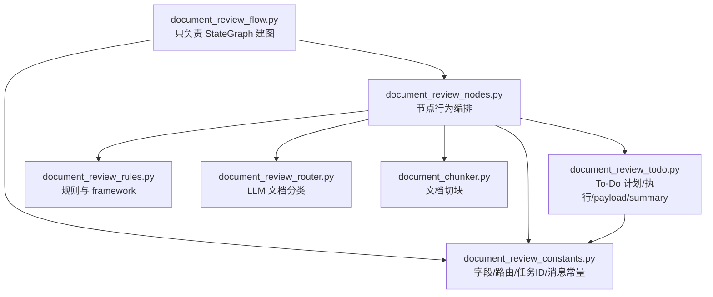

# 投资文档审查 Flow 模块拆分计划

## 背景

`src/investory/agent_core/runtime/flow/investment_document_review/document_review_flow.py` 当前约 1800 行，职责过多，混合了：

- LangGraph 图构建
- 节点执行逻辑
- To-Do plan 生成
- To-Do plan 执行
- payload 组装
- summary 聚合
- 日志记录
- reflection / risk assessment / final result 构建

这会导致：

1. 图结构不清晰，阅读成本高。
2. 节点行为和执行细节难以独立测试。
3. 新增能力时容易继续把复杂度堆回 `document_review_flow.py`。
4. `generate_review_todo_plan` 一类策略逻辑和 `_build_graph` 图编排混在一起，模块边界不清晰。

本次重构目标是：**让 `document_review_flow.py` 只保留构建图的逻辑，其余职责抽取到 `investment_document_review` 目录下的新模块。**

---

## 目标边界

`document_review_flow.py` 只保留：

- `InvestmentDocumentReviewFlow.__init__`
- `InvestmentDocumentReviewFlow.run`
- `InvestmentDocumentReviewFlow._build_graph`
- `build_investment_document_review_flow`
- 图节点枚举 `InvestmentDocumentReviewNode`
- 必要的兼容 re-export

节点行为、To-Do 计划、To-Do 执行、payload 组装、日志、结果构建全部迁移到同目录新模块。

---

## 拆分后的模块关系



---

## 模块职责设计

### 1. `document_review_constants.py`

路径：`src/investory/agent_core/runtime/flow/investment_document_review/document_review_constants.py`

职责：集中保存投资文档审查 flow 的稳定业务常量。

迁移内容：

- 字段常量：
  - `ACTION_FIELD`
  - `MESSAGE_FIELD`
  - `DOCUMENT_TYPE_FIELD`
  - `REVIEW_FIELD`
  - `RISK_ASSESSMENT_FIELD`
  - `APPROVAL_FIELD`
  - `STATUS_FIELD`
  - `REQUIRED_ROLE_FIELD`
  - `MISSING_FIELDS_FIELD`
  - `ROUTE_REASON_FIELD`
  - `ROUTE_CONFIDENCE_FIELD`
  - `REVIEW_RESULT_FIELD`
  - `TODO_PLAN_FIELD`
  - `TODO_RESULTS_FIELD`
  - `REVIEW_SUMMARY_FIELD`
  - `CRITERIA_FIELD`
  - `MAX_ROUNDS_FIELD`

- 路由常量：
  - `MISSING_ROUTE`
  - `REFUSAL_ROUTE`
  - `COMPLETE_ROUTE`
  - `PENDING_APPROVAL_ROUTE`

- To-Do / chunk 常量：
  - `CHUNK_INDEX_FIELD`
  - `CHUNK_COUNT_FIELD`
  - `CHUNK_REVIEW_SCOPE_FIELD`
  - `FULL_DOCUMENT_REVIEW_SCOPE`
  - `CHUNK_REVIEW_SCOPE`
  - `CHUNK_EXTRACT_TASK_ID_PREFIX`
  - `FULL_DOCUMENT_EXTRACT_TASK_ID`
  - `ANALYZE_TASK_ID_PREFIX`
  - `AGGREGATE_ANALYZE_TASK_ID`
  - `SYNTHESIZE_REVIEW_TASK_ID`
  - `COMPLETED_TODO_RESULT_STATUSES`

- 文案和反思标准：
  - `MISSING_INPUT_MESSAGE`
  - `CLASSIFICATION_CLARIFICATION_MESSAGE`
  - `REFUSAL_MESSAGE`
  - `DEFAULT_REFLECTION_MAX_ROUNDS`
  - `INVESTMENT_DOCUMENT_REVIEW_REFLECTION_CRITERIA`

- 输出动作枚举：
  - `InvestmentDocumentReviewAction`

原因：这些常量是跨 nodes / todo / flow / tests 共享的协议层内容，不属于图构建。

---

### 2. `document_review_todo.py`

路径：`src/investory/agent_core/runtime/flow/investment_document_review/document_review_todo.py`

职责：集中保存 To-Do plan 的生成、执行、resume、payload 组装和 summary 聚合。

迁移内容：

#### To-Do resume 协议

- `InvestmentDocumentReviewTodoResumeStore`

#### To-Do plan 判断与生成

- `should_use_chunk_review`
- `should_use_code_built_plan`
- `is_chunked_document`
- `_normalize_todo_task_id_fragment`
- `_build_chunk_review_analyze_tasks`
- `generate_review_todo_plan`
- `_build_known_type_full_document_plan`
- `_build_chunk_review_todo_plan`
- `_guess_review_plan_chunk_count`

#### To-Do 执行

- `execute_review_todo_plan`
- `_load_todo_resume_state`
- `_save_todo_resume_state`
- `_build_todo_execution_runner`
- `_execute_review_todo_task`
- `_build_review_todo_task_execution`

#### To-Do payload 组装

- `build_review_todo_plan_payload`
- `_build_review_todo_common_payload`
- `_build_review_todo_extract_payload`
- `_build_review_todo_analyze_payload`
- `_build_review_todo_dependency_results`
- `_build_review_todo_synthesize_payload`

#### To-Do summary / status 聚合

- `_build_completed_todo_results`
- `_find_succeeded_todo_result`
- `_build_review_todo_summary`
- `_build_review_task_status_summary`
- `_string_list_from_result`
- `_string_from_result`
- `_todo_result_error_message`
- `_todo_incomplete_review_note`
- `_todo_task_skip_reason`
- `_count_todo_results_by_status`

#### To-Do 日志

- `_log_review_todo_plan_generated`
- `_build_review_todo_runner_event_handler`
- `_log_review_todo_execution_started`
- `_log_review_todo_execution_completed`

原因：To-Do 逻辑是当前 `document_review_flow.py` 中最重的职责，应独立成一个领域模块。

---

### 3. `document_review_nodes.py`

路径：`src/investory/agent_core/runtime/flow/investment_document_review/document_review_nodes.py`

职责：保存 LangGraph 节点实际执行逻辑。它不是图构建者，而是节点处理器集合。

新建类：

```python
class InvestmentDocumentReviewNodeHandlers:
    def __init__(
        self,
        *,
        executor: TaskExecutor,
        llm_router: InvestmentDocumentReviewRouter,
        supports_realtime_data: bool,
        todo_resume_store: InvestmentDocumentReviewTodoResumeStore | None,
    ) -> None:
        ...
```

这个类持有原 `InvestmentDocumentReviewFlow` 节点执行所需依赖：

- `executor`
- `llm_router`
- `supports_realtime_data`
- `todo_resume_store`

迁移节点方法：

#### policy / classification / framework

- `evaluate_policy_gate`
- `route_after_policy_gate`
- `classify_document_type`
- `route_after_classification`
- `build_review_framework`
- `route_after_review_framework`

#### review / todo / reflection / risk

- `run_single_pass_review`
- `generate_review_todo_plan`
  - 可委托给 `document_review_todo.generate_review_todo_plan`
- `execute_review_todo_plan`
  - 可委托给 `document_review_todo.execute_review_todo_plan`
- `reflect_review_output`
- `assess_review_risk`
- `route_after_risk_assessment`

#### final result

- `build_final_result`
- `build_pending_approval_result`
- `build_missing_input_result`
- `build_refusal_result`

#### reflection / risk payload

- `_build_review_reflection_payload`
- `_build_review_risk_assessment_payload`

原因：节点实现本身仍然是 flow 业务逻辑，但不是图结构。独立 handler 能让 `document_review_flow.py` 保持极薄。

---

### 4. `document_review_flow.py`

路径：`src/investory/agent_core/runtime/flow/investment_document_review/document_review_flow.py`

重构后只保留：

```python
class InvestmentDocumentReviewFlow:
    def __init__(...):
        self.nodes = InvestmentDocumentReviewNodeHandlers(...)
        self.graph = self._build_graph()

    def run(...):
        ...

    def _build_graph(self):
        graph = StateGraph(InvestmentDocumentReviewState)
        graph.add_node(..., self.nodes.evaluate_policy_gate)
        graph.add_node(..., self.nodes.classify_document_type)
        ...
        graph.add_conditional_edges(..., self.nodes.route_after_policy_gate, ...)
        ...
        return graph.compile()


def build_investment_document_review_flow(...):
    ...
```

并保留兼容 re-export：

- `InvestmentDocumentReviewFlow`
- `build_investment_document_review_flow`
- `InvestmentDocumentReviewAction`
- `should_use_chunk_review`
- 目前测试和 gateway 直接 import 的字段常量

原因：避免这次重构同时造成大量导入路径变更。导入路径清理可以后续单独做。

---

## 外部依赖影响

当前依赖 `document_review_flow.py` 的主要入口：

- `src/investory/main.py`
  - 使用 `build_investment_document_review_flow`

- `src/investory/gateway/api.py`
  - 使用 `InvestmentDocumentReviewFlow`
  - 使用 `build_investment_document_review_flow`

- `tests/test_investment_document_review_flow.py`
  - 直接导入大量常量、`InvestmentDocumentReviewAction`、`InvestmentDocumentReviewFlow`、`should_use_chunk_review`
  - 直接调用多个节点方法

- `tests/test_investment_document_review_gateway_api.py`
  - 导入结果字段常量和 `InvestmentDocumentReviewFlow`

- `tests/test_investment_document_review_v1_minimal_validation.py`
  - 不直接依赖 flow 导出，但验证 Todo plan / extract / analyze / synthesize 的数据契约

兼容策略：

1. 生产入口保持不变。
2. 常量先 re-export，减少测试大面积修改。
3. 节点级测试可改为 `flow.nodes.xxx(...)`，或优先通过 graph 行为测试。
4. 不在本次重构中改变 API 输出结构。

---

## 实施步骤

### Step 1: 新增 constants 模块

- 创建 `document_review_constants.py`
- 迁移常量和 `InvestmentDocumentReviewAction`
- 在旧 flow 文件中从新模块导入并 re-export
- 验证无循环导入

### Step 2: 新增 todo 模块

- 创建 `document_review_todo.py`
- 迁移 To-Do resume 协议、计划生成、执行、payload、summary、日志相关函数
- 把原来依赖 `self` 的方法改为函数或小型执行器结构：
  - 需要 `executor`
  - 需要 `todo_resume_store`
  - 需要 `state`
- 保持返回结构不变：`dict[str, Any]`

### Step 3: 新增 nodes 模块

- 创建 `document_review_nodes.py`
- 新建 `InvestmentDocumentReviewNodeHandlers`
- 迁移节点方法
- 对 To-Do 节点调用，委托给 `document_review_todo.py`
- 保持节点返回结构和路由字符串不变

### Step 4: 精简 flow 文件

- `document_review_flow.py` 中初始化 `self.nodes`
- `_build_graph` 全部改为绑定 `self.nodes.xxx`
- 删除已迁移的方法实现，只保留图构建入口
- 保留必要 re-export

### Step 5: 调整测试

优先调整直接节点调用：

- `flow.generate_review_todo_plan(state)` → `flow.nodes.generate_review_todo_plan(state)`
- `flow.execute_review_todo_plan(state)` → `flow.nodes.execute_review_todo_plan(state)`
- `flow.assess_review_risk(state)` → `flow.nodes.assess_review_risk(state)`
- `flow.build_final_result(state)` → `flow.nodes.build_final_result(state)`

常量 import 暂时保持从 `document_review_flow.py` 导入。

### Step 6: 验证

使用仓库 `.venv` 执行：

```powershell
.venv\Scripts\python.exe -m pytest tests/test_investment_document_review_flow.py tests/test_investment_document_review_gateway_api.py tests/test_investment_document_review_v1_minimal_validation.py
```

然后读取最近编辑文件 lints。

### Step 7: 更新 worklog

更新：

`docs/2-2/worklog/15-todo_plan_generation_strategy_refactor_execution_worklog.md`

记录：

- 拆分出的模块
- 每个模块职责
- 验证命令
- 测试失败与修复过程（如有）
- 最终结果

---

## 风险点与处理策略

### 风险 1: 循环导入

高风险链路：

```text
document_review_flow.py -> document_review_nodes.py -> document_review_todo.py -> document_review_constants.py
```

避免策略：

- `constants.py` 不反向导入 flow / nodes / todo
- `todo.py` 不导入 nodes / flow
- `nodes.py` 可以导入 todo / constants / rules / router / chunker
- `flow.py` 只导入 nodes / constants

### 风险 2: 测试直接调用 flow 实例节点方法

处理策略：

- 本次不建议继续在 `InvestmentDocumentReviewFlow` 上代理所有节点方法，否则 flow 文件仍然承担节点 API。
- 测试改为通过 `flow.nodes.xxx` 调用。
- 对业务入口仍使用 `flow.run(...)`。

### 风险 3: 常量 import 路径破坏

处理策略：

- `document_review_flow.py` 先保留 re-export。
- 后续若要清理，再单独做测试导入路径迁移。

### 风险 4: To-Do 执行函数依赖 `self.executor`

处理策略：

- `document_review_todo.py` 中函数显式接收 `executor` / `todo_resume_store`。
- `InvestmentDocumentReviewNodeHandlers` 负责注入依赖。

---

## 验收标准

1. `document_review_flow.py` 明显变薄，只保留 graph 构建、run 入口、工厂函数和兼容导出。
2. `document_review_todo.py` 承担 To-Do plan / execute / payload / summary 逻辑。
3. `document_review_nodes.py` 承担节点行为逻辑。
4. `document_review_constants.py` 承担共享协议常量。
5. 生产入口导入不变：
   - `src/investory/main.py`
   - `src/investory/gateway/api.py`
6. 核心测试通过：
   - `tests/test_investment_document_review_flow.py`
   - `tests/test_investment_document_review_gateway_api.py`
   - `tests/test_investment_document_review_v1_minimal_validation.py`
7. Worklog 已更新。